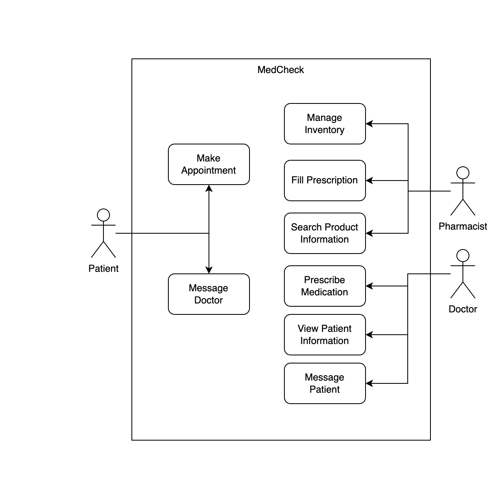

# MedCheck

Project for CSC340

## Title

MedCheck

## Team Members

Members:

- Andy Salinas Guerrero
- Dev Patel
- Noah Phillips

## Nickname

MedCheck

## Description (about 100 words)

This management system app will be an easy way for pharmacies to manage distribution of medications.
If a medication is prescribed that has a conflict with another, our app will automatically notify the
doctor and pharmacist and give options for a better suited medication.

Our app allows for doctors to prescribe medications and pharmacists to fill those medications. It also
allows everyone access to product information. Only doctors and pharmacists can see the medication conflict
resolution. Patient information is only viewable by the doctor and patient.

Security is established by having each actor only be able to access their own functions.

> [!NOTE]
> We use an [API](https://open.fda.gov/) to view drug information.

